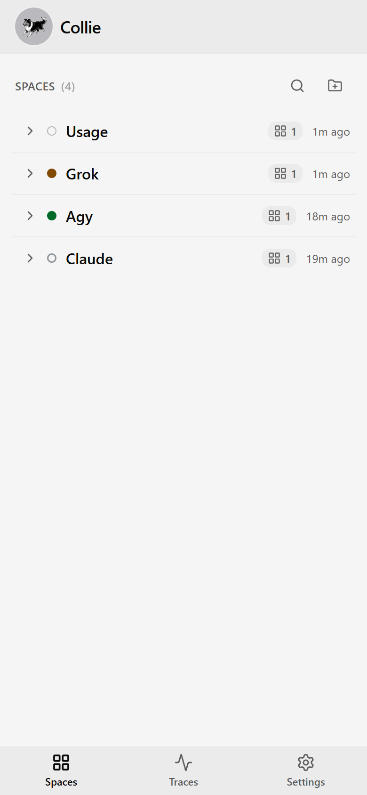
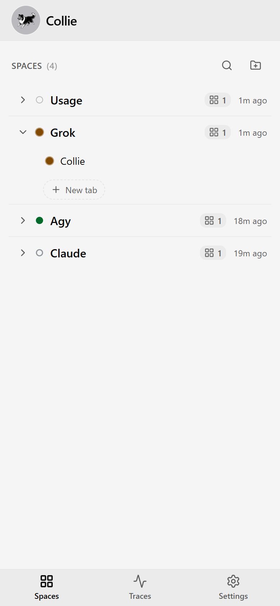

# Collie

<p align="center">
  
</p>

A phone web UI for your [Herdr](https://herdr.dev) agent herd, served over Tailscale. Open a URL, see
which agent is waiting on you, and answer it with your phone's keyboard.

The reply box is an ordinary text field, so your phone's own voice dictation works in it; Collie
ships none of its own.

It assumes a [Tailscale](https://tailscale.com) tailnet — your phone and the host on the same one —
and it is **single-user**: one operator, one tailnet, no multi-tenant auth. If you need shared or
public access, Collie isn't built for it. Read the
[security note](#%EF%B8%8F-security--read-before-you-run-it) either way.

**Features**

- **React Router + Vite** — TypeScript, Tailwind, shadcn, and a Bun bridge
- **A dashboard ranked by who needs you**, not by what changed last
- **Push notifications** the moment an agent is waiting on you
- **Quick actions and slash commands** per agent — tap, don't type
- **Special-keys pad** — `Esc`, `Ctrl+C`, arrows, combinable modifiers
- **Find in output**, and **conversation history** the terminal can't scroll back to
- **Send an image** from your camera roll
- **Switch between Herdr sessions** without touching the host
- **Installs to your home screen** (PWA) and runs entirely on your own machine — loopback bind, no
  cloud, no account

> **This is a fork** of [AltanS/collie](https://github.com/AltanS/collie) with extra security hardening (fail-closed Host and identity gates, loopback-bind enforcement, safe `.env` parsing, upload sniffing, release-tag-pinned updates) and Grok harness support. Upstream is merged in regularly; see [`CHANGELOG.md`](./CHANGELOG.md).

## Contents

- [Demo](#demo)
- [Security — read first](#%EF%B8%8F-security--read-before-you-run-it)
- [Requirements](#requirements)
- [Install](#install)
- [First run — what you'll see](#first-run--what-youll-see)
- [Configure](#configure) · [Your own slash commands](#your-own-slash-commands) · [SSSF traces tab](#sssf-traces-tab) ·
  [Multi-session](#multi-session)
- [Dark mode / light mode](#dark-mode--light-mode)
- [Desktop mode](#desktop-mode)
- [Commands](#commands)
- [Manage & update](#manage--update)
- [Deployment variants](#deployment-variants) · [B–E in `DEPLOYMENT.md`](./DEPLOYMENT.md)
- [Windows (experimental)](#windows-experimental)
- [Web Push](#web-push-optional)
- [Troubleshooting](#troubleshooting)
- [Architecture](#architecture)
- [Developing this plugin](#developing-this-plugin)

## Demo

The home screen is one folder tree (space → tab → pane; a single child opens straight through), agents needing you sort to the top, and the bottom bar is Spaces / Traces / Settings. The header **‹** and the phone's swipe-back gesture both go back exactly one screen; if Android relaunches the installed app after **Open in browser**, you return to the screen you left rather than the dashboard. A pane opens raw; ⚙ → Display → Raw terminal off gives tappable prompt buttons. Long-press a row to rename or close.

<table>
  <tr>
    <td align="center" width="50%"><br><sub><b>Spaces</b> — the tree; agents needing you sort to the top</sub></td>
    <td align="center" width="50%"><br><sub><b>Ask</b> — with Raw terminal off, Claude's questions become tappable buttons</sub></td>
  </tr>
  <tr>
    <td align="center" width="50%"><br><sub><b>Expanded</b> — a space opened onto its tabs and panes</sub></td>
    <td align="center" width="50%"><br><sub><b>Keys</b> — the special-keys pad, no chords to remember</sub></td>
  </tr>
  <tr>
    <td align="center" width="50%"><br><sub><b>Session switcher</b> — one bridge, every herd</sub></td>
    <td align="center" width="50%"><br><sub><b>Settings</b> — notifications, DND, diagnostics</sub></td>
  </tr>
</table>

## ⚠️ Security — read before you run it

**Collie is remote shell access to your machine, by design.** Anyone who can reach the URL can read
panes and run commands as your user. Treat the URL like a root login.

The sharp edges:

- **It acts as _you_**, with full privileges — `~/.ssh`, `git push --force`, `rm -rf`, `sudo`.
- **Access is device-level, not person-level.** Tailscale proves the device, not who's holding it; an
  unlocked or stolen phone is an open shell. The idle lock pauses an unattended screen and gates
  nothing (details: [ADR 0007](./.adr/0007-the-idle-lock-is-a-pause-not-a-gate.md)).
- **Every uid on the host can reach the TCP port.** The per-device gate closes the write half; reads
  stay open (details: [ARCHITECTURE.md §6](./ARCHITECTURE.md#6-security-model)).
- **One bridge fronts _every_ session** under your config root (details: [Multi-session](#multi-session)).
- **Every write is appended to `<state-dir>/audit.log`**; a trail is not a gate (details:
  [ARCHITECTURE.md §6](./ARCHITECTURE.md#6-security-model)).
- **Authorising individual devices** needs a proxy in front — see [`DEPLOYMENT.md`](./DEPLOYMENT.md).

It's built single-user and tailnet-only. The defenses:

- **Loopback bind only** (`127.0.0.1`) — never `0.0.0.0`. The bridge refuses non-loopback
  `COLLIE_HOST`; `COLLIE_ALLOW_NON_LOOPBACK_BIND=1` disables the bind and peer checks, leaving the
  front door as your only control.
- **Exactly one hardened front door** — `tailscale serve` (default, Variant A) or a conforming
  reverse proxy ([Variant C](./DEPLOYMENT.md#variant-c--reverse-proxy-as-the-only-front-door-no-tailscale)); never `tailscale funnel` or a bare port.
- **Optional identity gate** — `COLLIE_TRUSTED_USER` rejects mismatching and missing
  `Tailscale-User-Login` headers. `COLLIE_TRUSTED_USER_OPTIONAL=1` allows host-local callers again,
  reopening the tagged-node gap.
- **Optional per-device gate** — set `COLLIE_DEVICE_HEADER` + `COLLIE_DEVICE_ALLOWLIST`; only
  allowlisted devices can drive agents or change notification settings. Others, including requests
  without the header, are read-only. See [`DEPLOYMENT.md`](./DEPLOYMENT.md).
- **Same-origin gate + strict CSP**; pane output renders as React text nodes, never `innerHTML`.
- **Host allowlist (fail-closed)** — loopback, discovered Tailscale hosts (`COLLIE_TAILSCALE_HOSTS`),
  `COLLIE_PUBLIC_HOSTS`, and hosts from `COLLIE_ALLOWED_ORIGINS` are accepted; otherwise `403 host not
  allowed`. `COLLIE_ALLOW_ANY_HOST=1` disables validation.

> 🚫 **Never `tailscale funnel` this** — funnel exposes it to the public internet; `serve` keeps it
> tailnet-only.

## Requirements

On the **host** (the tailnet node your agents run on). Need Herdr 0.7.0+ — check with
`herdr --version`.

| Tool | Why |
| --- | --- |
| [**Bun**](https://bun.sh) | Runs the bridge and builds the web UI — the only hard dependency. |
| [**Herdr**](https://herdr.dev) ≥ 0.7.0 | The herd Collie mirrors; its CLI registers the plugin. |
| [**Tailscale**](https://tailscale.com) | Front door for the default variant (`tailscale serve`); optional if you run [Variant C](./DEPLOYMENT.md#variant-c--reverse-proxy-as-the-only-front-door-no-tailscale) behind your own reverse proxy. Without any front door, the bridge is `127.0.0.1`-only. |
| **git** | Clone, and the `update` command. |

Soft dependencies: **Node.js** (the control script uses it to extract your MagicDNS name from
`tailscale status --json`; without it the banner falls back to the loopback URL) and a **service
supervisor** — `systemd --user` on Linux, **launchd** on macOS (both ship with the OS); a host with
neither falls back to an unsupervised `nohup` process. You never install JS
deps by hand — the build runs `bun install` for you; the backend imports only Bun + `node:*`.
[`web-push`](https://www.npmjs.com/package/web-push) is optional and lazy (see [Web
Push](#web-push-optional)).

**Linux and macOS are supported hosts.** The bridge also runs on **Windows** (experimental) — see
[Windows](#windows-experimental).

## Install

On the host, not your phone. Two ways in.

**From GitHub (turnkey)** — Herdr fetches and builds for you:

```bash
herdr plugin install bartholomewtj/collie
herdr plugin action invoke start --plugin herdr.collie
```

**From a local clone (for development)** — registered by path:

```bash
git clone https://github.com/bartholomewtj/collie.git && cd collie
herdr plugin link "$(pwd)"
herdr plugin action invoke start --plugin herdr.collie
```

Either way, `start` does four things:

1. **builds** `web/dist` if it's missing (typechecked, staged, swapped in atomically),
2. **starts the bridge** as the `systemd --user` service `collie` (`nohup` fallback without systemd),
3. **publishes it on the tailnet** — literally `tailscale serve --bg 8787`: HTTPS on the host's
   MagicDNS name, `:443 → 127.0.0.1:8787`, tailnet-only,
4. **prints the banner** with the URL to open — walked through line by line in
   [First run](#first-run--what-youll-see).

> No Herdr? Run `scripts/collie-ctl.sh start` directly — same effect (config then lives in
> `~/.config/collie/.env`).

## First run — what you'll see

The transcripts below are the control script's inline output. **Through `invoke start` you get
Herdr's JSON envelope instead** — the same text is the action's *captured stdout*, read with
`herdr plugin log list --plugin herdr.collie`.

```console
$ scripts/collie-ctl.sh start
building web UI (first run)…                    # linked clone only; a GitHub install already built
…bun install · typecheck · vite build output…
bridge started (systemd --user: collie)
tailscale serve (https) → tailnet :443 -> 127.0.0.1:8787

  ✓ Collie is running  ·  v0.15.0+174c4e4
    service   systemd --user (collie) · active
    local     http://127.0.0.1:8787
    tailnet   https://myhost.tail1234.ts.net
```

The `✓` is a real probe — the script connected to the bridge's port and got an answer, not just
"the unit is active". If you get `⚠ Collie isn't answering on :8787 yet` instead, see
[Troubleshooting](#troubleshooting).

### What just happened

`start` left three durable things on the host:

1. **`web/dist`** — the built UI, served from disk, so later rebuilds go live without a restart.
2. **A supervised user service** — a `systemd --user` unit named `collie`, or a launchd agent on
   macOS ([Surviving reboots](#surviving-reboots) has the details of both).
3. **A tailnet-only `tailscale serve` mapping** — HTTPS on the host's MagicDNS name,
   `:443 → 127.0.0.1:8787`, TLS terminated by Tailscale. Inspect with `tailscale serve status`;
   remove just this mapping with `scripts/collie-ctl.sh unserve`.

`stop` merely pauses the service; `uninstall` reverses 2 + 3 and keeps your `.env` and the checkout.
Why a service and not a Herdr pane: [`ARCHITECTURE.md`](./ARCHITECTURE.md) §3.

### Open it on your phone

The URL is the banner's `tailnet` line — print it again anytime with `scripts/collie-ctl.sh url`, or
`scripts/collie-ctl.sh qr` to print it as a QR code you can scan. It resolves for any device on your
tailnet, so the phone needs the Tailscale app installed and connected to the same tailnet as the
host.

Then install it as an app: **iOS** — Safari → share sheet → *Add to Home Screen*. **Android** —
Chrome → ⋮ menu → *Add to Home screen* (or *Install app*). Installing (and Web Push) needs the
HTTPS origin the default serve mode already provides; over `COLLIE_SERVE_MODE=http` the page works,
but service worker and install silently no-op.

### Is it actually working?

A sixty-second check, host side then phone side:

```console
$ scripts/collie-ctl.sh status

  ✓ Collie is running  ·  v0.15.0+174c4e4
    service   systemd --user (collie) · active
    local     http://127.0.0.1:8787
    tailnet   https://myhost.tail1234.ts.net

  serve config:
    https://myhost.tail1234.ts.net (tailnet only)
    |-- / proxy http://127.0.0.1:8787
```

```console
$ scripts/collie-ctl.sh logs        # journal timestamps trimmed here
[push] disabled (no VAPID keys configured)
[bridge] listening on http://127.0.0.1:8787  (poll 1500ms)
[bridge] WARNING: COLLIE_TRUSTED_USER is empty — any tailnet device/user that reaches the bridge gets full write access. Set it to your tailnet login (see README → Variant A).
[bridge] WARNING: COLLIE_PUBLIC_HOSTS is empty — Host-header validation is OFF (DNS rebinding not blocked). Set it to your MagicDNS name, especially under COLLIE_SERVE_MODE=http.
```

**Both WARNINGs are expected on a fresh install** — that's the bridge telling you it's running
open-by-default on your tailnet. [Configure](#configure) closes both. (The loopback URL in the log
is also correct: the bridge itself only ever binds `127.0.0.1` — `tailscale serve` is what makes it
reachable.) `[push] disabled` is expected too: notifications are opt-in, and
[Web Push](#web-push-optional) is three commands.

On the phone: your agents are listed, and the footer build stamp (`v0.9.0 · debcff9 · …`) matches
`scripts/collie-ctl.sh version`. If the page loads but stays empty, that's the same-origin gate —
see [Troubleshooting](#troubleshooting).

## Configure

Out of the box Collie runs **open single-user**: anyone on your tailnet who can reach the URL has
full control — that's what the startup WARNING is about. Close it in one line:

```bash
# in your .env
COLLIE_TRUSTED_USER=you@example.com           # your tailnet login — the bridge rejects anyone else
```

Host-header validation is already on and fails closed (this fork, ADR 0023): `collie-ctl.sh`
discovers your Tailscale name/IPs and injects them, so a normal tailnet install needs nothing more.
Behind your own reverse proxy (`COLLIE_SKIP_SERVE=1`) you **must** set
`COLLIE_PUBLIC_HOSTS=collie.example.com` or every request gets `403 host not allowed`.

Config is a `.env` in the plugin's config dir — find it with
`herdr plugin config-dir herdr.collie` (typically `~/.config/herdr/plugins/config/herdr.collie`;
without Herdr, `~/.config/collie`). `collie-ctl.sh` resolves this same dir whether you run it
directly or via a Herdr action:

```bash
cp .env.example "$(herdr plugin config-dir herdr.collie)/.env"
```

The bridge reads `.env` only at startup — after any edit, `scripts/collie-ctl.sh restart`. See
[`.env.example`](./.env.example) for the full option list — commonly `COLLIE_PORT`, or
`COLLIE_SERVE_MODE=http` (Headscale / `.internal` domains; read by the control script when it runs
`tailscale serve`).

Reading history from more than one agent home? List them all in `COLLIE_TRANSCRIPT_ROOT`,
comma-separated.

### Files tab

The optional Files tab is a read-only browser of the operator's work directory. Set
`COLLIE_WORK_ROOT=~/Projects` (or `COLLIE_WORK_ROOT=C:\\claudeos` on Windows); unset means no tab and
no `/api/files*` routes. It supports folder navigation, filename search, text preview, copying a
relative path, downloading files, and **Open in browser** for types Chrome on a phone can display
(PDF, images, audio, video, a few text types, and HTML). Images, audio and video also play in the
Files tab; PDF and HTML stay on Open in browser (an in-page PDF viewer is flaky on iPhone; HTML
opens as a unique-origin sandbox so its scripts do not run and it cannot call Collie's API). SVG,
XML and JS stay download-only. Nothing is written,
renamed, deleted, uploaded, or sent to a pane.
Every dot-name and `node_modules`, `config` (intentionally refused), `__pycache__`, `venv`, `target`,
`vendor`, caches, and key/certificate names are skipped and refused even by typed path. Anything under
the root is readable by every device that can reach Collie, so use a work tree—not `$HOME` or a
location containing credentials or patient data.

### SSSF traces tab

If you run [Super Simple Software Factory](https://github.com/disler/super-simple-software-factory)
ADWs in a repo, Collie can show that repo's trace UI under a **Traces** tab in the bottom bar: a
list of every SSSF repo found near your spaces' panes (a dot on the one with a run going), each
opening the visualiser full-screen with **‹ back** to the list. Point Collie at the visualiser's
source folder (the sssf skill's app) and restart:

```bash
# in your .env
SSSF_VIZ_DIR=~/.claude/skills/sssf/apps/visualizer
```

Collie builds the visualiser once into its own state dir (`sssf-viz/`, ~2 s on first start, again
whenever the source is newer) and serves it under `/sssf/`; **nothing is copied into the Collie
checkout**. Which repo: for each workspace Collie looks near its panes' working directories — up to
the enclosing git worktree root, **and up to two levels down** (a pane parked in a folder of repos
counts) — for roots holding `adws/adw_data/sssf.db`. The list puts a running repo first; opening
one with a live run lands straight on that run's lanes. A repo with an `adws/` folder but no traces
yet shows greyed; nothing SSSF-shaped near any space hides the Traces tab altogether.

**From the pane that ran it.** A pane whose runs the tracer attributed to it gets a lanes button in
its header (a green dot while one is still going). Tap it and the visualiser opens on that pane's
newest run, with a chip row of every run the pane launched (newest first, across repos) to switch
between; **‹ back** returns to the pane. Attribution is exact, not guessed from folders: Herdr
exports `HERDR_PANE_ID` into every pane, and an SSSF tracer from
[claudeSSSF](https://github.com/bartholomewtj/claudeSSSF) (2026-08-18 on) records it on the run
(`sessions.pane_id`) — so it covers ADWs run from that pane's shell *and* ones an agent in it launched
through its own shell tool. Runs from an older tracer, a scheduler, or a plain terminal carry no pane
and simply don't get the button.

The tab is Collie-only — Herdr never sees it — and the visualiser runs in a sandboxed frame that
cannot reach Collie's own API. Archiving a run is off inside the tab; use the visualiser standalone
(`just obs`) for that. If Collie logs `[sssf] disabled: …` at start, the folder is missing, isn't the
visualiser, or (after a skill re-install) lacks the host-mount patches — the rest of Collie is
unaffected. Read-only devices see the traces like anything else.

**Custom domain or reverse proxy?** [`DEPLOYMENT.md`](./DEPLOYMENT.md) has the full front-door setup.
The one rule to know here: Collie is same-origin only, so a different hostname or TLS terminator
needs the exact origin allowed —

```bash
COLLIE_ALLOWED_ORIGINS=https://collie.example.com
```

— and until you do, the page loads and stays empty
([Troubleshooting](#troubleshooting) has the symptom).

### Your own slash commands

Commands only this machine has (a plugin's `/fork-in-herdr`, your own `/deploy`) go in
`commands.toml`:

```bash
cp commands.toml.example "$(herdr plugin config-dir herdr.collie)/commands.toml"
```

```toml
[[commands]]
scope = "omp"                # optional; omit for every pane
command = "/fork-in-herdr"
description = "Fork this conversation into a new herdr tab"
```

A pane your rows match shows only your rows (narrowest row wins,
[ADR 0018](./.adr/0018-operator-command-rows-replace-the-catalog.md)). Add `confirm = true` for a
two-tap confirm. No restart — edits are live. Verify: open a pane, tap **/**, your rows are on the
first screen. Syntax error? `journalctl --user -u collie -n 20` names the line.

### Your own quick replies

The composer's **Quick** dock ships yes / no / continue / commit and push / retry / skip. Put your
own one-tap replies in the same `commands.toml`:

```toml
[[quick]]
text = "run the tests"       # sent verbatim, then Enter — one line, up to 80 chars
group = "mine"               # optional; rows sharing a group render as one grid (default "mine")
scope = "claude"             # optional; omit for every agent pane

[[quick]]
text = "yes"
group = "confirm"
```

Same rule as commands: on a pane any of your rows address, the dock is **your rows only** — so keep
"yes" / "no" if you still want them (`commands.toml.example` does). Shells always keep y / n. Live,
no restart; reload the page to see them.

### Your own Keys presets

The Keys tray's labelled chords under **Presets** (the shipped Ctrl C/D/U/R/L/Z) become yours in
`keys.toml` next to `.env`. The rest of the tray — Esc, arrows, Enter, digits, F1–F12 — stays
fixed; a phone has no other route to those keys.

```bash
cp keys.toml.example "$(herdr plugin config-dir herdr.collie)/keys.toml"
```

```toml
[[keys]]
scope = "claude"             # optional; omit for every pane
label = "Yes"
keys = ["Down", "Enter"]     # one batch; herdr spelling, never tmux's C-c
# danger = true              # two-tap confirm
```

Same rule as commands: a pane your rows address shows **your rows only**. Live; reload the page.

### Multi-session

`COLLIE_MULTI_SESSION=on` (the default) discovers and serves every named Herdr session under your
config root, switchable from the header; `COLLIE_MULTI_SESSION=off` serves only the primary one. Every
session it finds is drivable through the same URL — including a private or sandbox one, which is why
[Security](#%EF%B8%8F-security--read-before-you-run-it) lists this as a sharp edge.

## Dark mode / light mode

Collie follows your phone by default; pin System, Light or Dark in **Settings → Appearance**. Pane
display (raw terminal, text size, tap-to-type) is under composer ⚙ and stored per device. Raw
terminal is on by default; turn it off for parsed prompt buttons. The mirror stays dark and inverts
in light mode so agents' absolute colours remain readable ([ADR 0002](./.adr/0002-invert-the-light-terminal-mirror.md)).

## Desktop mode

Turn it on in **Settings → Desktop mode**. It is stored per browser and is not auto-detected. The always-visible “Desktop mode is on · Turn off” strip is the way back.

Choose **Settings → Typing surface**:

- **Composer** — Enter sends, Shift+Enter makes a new line, and Ctrl+Enter still sends. Esc, Tab and the arrows pass through to the terminal when the box is empty.
- **Direct** — keys go straight into the terminal. Arm it by clicking the mirror or pressing Ctrl+`; the strip over the input says so. It releases on Stop, Ctrl+`, a click outside, window focus loss, or the idle pause. It is never remembered; a reload starts unarmed.

When the Composer surface is active, number keys pick prompt options through the dialog guard. They are not sent as raw terminal keys; other dialogs keep their number keys for the dialog itself.

When typing directly, one line of ordinary text goes straight through. Text with a line break or that looks destructive (`rm -r`, `sudo`, `--force`) is held with “Paste N lines into the terminal? Send · Discard”. Send keeps line breaks as Enter presses but never adds one at the end. Pasting an image uploads it and offers a **Type path** chip; the path is never typed for you.

| Hotkey | Action |
|---|---|
| Ctrl+` | Arm / release direct typing |
| Ctrl+F | Find in this pane or its history; ignored while direct typing |
| Ctrl+Alt+↑ / Ctrl+Alt+↓ | Previous / next pane, “needs you” first |

**Keys the browser keeps:** Ctrl+T, Ctrl+W, Ctrl+N, Ctrl+Shift+N, Ctrl+Tab, Ctrl+Shift+T, Alt+Left / Alt+Right, F11. It also keeps Ctrl+C when text is selected (copy), Ctrl+R and F5 (reload). Ctrl+C with nothing selected sends the interrupt.

Herdr cannot send Home, End, PageUp, PageDown, Insert or Delete — Collie says so instead of sending a look-alike.

## Commands

Every command works two ways: the **control script** on the host (`scripts/collie-ctl.sh <cmd>`) or
the equivalent **Herdr action** (`herdr plugin action invoke <cmd> --plugin herdr.collie`, written
below as `invoke <cmd>`). The ones you'll actually use:

| Action | Control script | Herdr action |
| --- | --- | --- |
| **Start** — build if needed, serve, print the URL | `collie-ctl.sh start` | `invoke start` |
| **Stop** — pause the bridge; removes nothing | `collie-ctl.sh stop` | `invoke stop` |
| **Restart** | `collie-ctl.sh restart` | `invoke restart` |
| **Status** — the *Collie is running* banner + URLs | `collie-ctl.sh status` | `invoke status` |
| **URL** — print the tailnet URL | `collie-ctl.sh url` | `invoke url` |
| **QR** — the same URL as a scannable code | `collie-ctl.sh qr` | — (script only) |
| **Version** — the running version (`0.x.y+sha`) | `collie-ctl.sh version` | `invoke version` |
| **Update** — advance the checkout + rebuild + restart | `collie-ctl.sh update` | `invoke update` |
| **Uninstall** — remove the service; keep `.env` + checkout | `collie-ctl.sh uninstall` | `invoke uninstall` |
| **Logs** — tail the journal / log file | `collie-ctl.sh logs` | — (script only) |
| **Push keys** — generate the VAPID keypair into your `.env` | `collie-ctl.sh push-keys` | `invoke push-keys` |
| **Push test** — send one notification to prove it works | `collie-ctl.sh push-test` | `invoke push-test` |

The actions are declared in `herdr-plugin.toml` and each one shells out to the control script; list
them live with `herdr plugin action list --plugin herdr.collie`. `build` · `serve` · `unserve` are
script-only too.

`start` and `status` end with the **Collie is running** banner — annotated line by line in
[First run](#first-run--what-youll-see). Its version comes from the *served* bundle stamp, so it is
the authoritative "what's running". **Through a Herdr action you get Herdr's JSON envelope, not the
banner** — the human-readable output is the action's *captured stdout*, read with
`herdr plugin log list --plugin herdr.collie` (or run the control script directly to see it inline).

## Manage & update

### Stop or uninstall

Pause the bridge without removing anything (a later `start` brings it right back):

```bash
scripts/collie-ctl.sh stop      # or: herdr plugin action invoke stop --plugin herdr.collie
```

To tear the service down completely — stop + disable it, remove the service definition (the
`systemd --user` unit, or the launchd agent plist on macOS), and remove
Collie's own `tailscale serve` mapping (port-scoped, so other tailnet mappings on the host survive) —
use `uninstall`. It leaves your `.env` and the checkout untouched:

```bash
scripts/collie-ctl.sh uninstall # or: herdr plugin action invoke uninstall --plugin herdr.collie
```

Then `herdr plugin uninstall herdr.collie` (or, for a linked clone, just deleting the directory)
removes the plugin registration itself.

### Update to a new release

The checkout *is* the plugin, and Herdr has no `plugin update` of its own. One command does the lot:

```bash
scripts/collie-ctl.sh update    # or: herdr plugin action invoke update --plugin herdr.collie
```

It advances the checkout to the newest release **of the major you are already on**, rebuilds the UI
and restarts the bridge (re-execing itself, so it's safe even when the update rewrites the script).
A new major is a separate act: `herdr plugin action invoke update-major --plugin herdr.collie`.
Confirm via the footer build stamp. Pinned to a version with `--ref`? Keep refreshing with
`herdr plugin install --ref …` — `COLLIE_UPDATE_REF` still overrides the tag pin.

Fails with *"You are not currently on a branch"*? That's a GitHub install made before 0.23.1, and
[Troubleshooting](#troubleshooting) has the one-time repair.

#### What `update` actually does to the checkout

Linked clones pull and re-link; managed installs advance to the newest release tag of the installed major. By hand, rebuild `web/` with `collie-ctl.sh build` (live) and restart after `bridge/` changes; run `scripts/install-hooks.sh` once. Why the two shapes differ: [`ARCHITECTURE.md`](./ARCHITECTURE.md) §5.

### Surviving reboots

A `systemd --user` service only runs while you have a login session. On a host that should serve
Collie unattended, enable lingering once:

```bash
loginctl enable-linger $USER
```

The unit is `enable`d, so with lingering it starts at boot with your user manager; the
`tailscale serve` mapping is persistent (`--bg`) and comes back on its own. Inspect the unit with
`systemctl --user status collie`.

**On macOS there's nothing to enable.** `start` installs a launchd agent
(`~/Library/LaunchAgents/herdr.collie.plist`) with `RunAtLoad`, so the bridge comes back when you log
in and launchd restarts it if it exits abnormally. Inspect it with
`launchctl print gui/$(id -u)/herdr.collie`. It's a *LaunchAgent*, not a daemon, so it starts at
**login** rather than at boot — a Mac sitting at the login window is not serving Collie. (Neither
supervisor? A `nohup` process with a pidfile in the config dir instead.)

## Deployment variants

The bridge always binds **loopback only**; deployments differ in what sits in front and how a request
proves who it is. Variant A is below; B–E are in [`DEPLOYMENT.md`](./DEPLOYMENT.md).

### Variant A — `tailscale serve` + person identity (default)

The happy path from [Install](#install). `tailscale serve` terminates TLS and injects
`Tailscale-User-Login`; set `COLLIE_TRUSTED_USER` to your tailnet login.

```bash
# in your .env
COLLIE_TRUSTED_USER=you@example.com
```

- **Granularity:** the tailnet *person*, not the device.
- **Why it's safe:** `serve` is the trusted injector of `Tailscale-User-Login`.

This is the right choice unless you need per-device control or no Tailscale; see [`DEPLOYMENT.md`](./DEPLOYMENT.md) for:

- [B — identity-aware proxy](./DEPLOYMENT.md#variant-b--identity-aware-proxy--per-device-authorisation)
- [C — reverse proxy](./DEPLOYMENT.md#variant-c--reverse-proxy-as-the-only-front-door-no-tailscale)
- [D — off-host identity proxy](./DEPLOYMENT.md#variant-d--off-host-identity-proxy-over-the-tailnet)
- [E — any other mesh or tunnel](./DEPLOYMENT.md#variant-e--any-other-mesh-or-tunnel-netbird-zerotier-cloudflare-tunnel)

## Windows (experimental)

Herdr on Windows exposes its control socket as a named pipe, so Collie dials it through `node:net` — [`ARCHITECTURE.md`](./ARCHITECTURE.md) §5.

What that means in practice:

- **Lifecycle is Task Scheduler**, via [`contrib/windows/`](./contrib/windows/README.md). Herdr action buttons (`update`, `restart`, `update-major`, …) run `build/collie-action-v1.exe`; PATH's `bash.exe` is the WSL stub and cannot be the command. POSIX twins are `*-posix`.
- **`tailscale serve` isn't wired up here.** Use [Variant C](./DEPLOYMENT.md#variant-c--reverse-proxy-as-the-only-front-door-no-tailscale) posture with `COLLIE_PUBLIC_HOSTS` pinned.
- **Set `COLLIE_MULTI_SESSION=off`** — session discovery derives POSIX paths.
- The socket path defaults to `%APPDATA%\herdr\herdr.sock`; override with `HERDR_SOCKET_PATH`.

The bridge logs `[events] stream up` on start, confirming live updates over the pipe.

## Web Push (optional)

Off unless you opt in. Three steps, and nothing to install — the sender (`web-push`) is already an
optional dependency, installed by the build:

```bash
herdr plugin action invoke push-keys --plugin herdr.collie   # 1. generate + write the VAPID keys
herdr plugin action invoke restart   --plugin herdr.collie   # 2. the bridge reads them at start
#                                                              3. on your phone: Settings → notifications
```

Step 1 is the one that used to be fiddly. `push-keys` generates the keypair *and* writes
`COLLIE_VAPID_PUBLIC` / `_PRIVATE` into the `.env` the service actually reads, at mode 600.

**Worth one extra keystroke:** pass a *subject* — the contact address RFC 8292 wants, so a push
service has a way to reach whoever is sending. An action carries no arguments, so this form is the
shell one:

```bash
bash scripts/collie-ctl.sh push-keys mailto:you@example.com
```

It refuses to replace live keys without `--force` because new keys invalidate subscriptions. Passing a
subject on an already-configured install only updates the contact address and leaves keys alone.

> **On a Herdr install older than 0.8.0**, actions are the set cached when the plugin was installed
> ([ADR 0006](./.adr/0006-update-advances-the-checkout-herdr-installed.md)), so `push-keys` and
> `push-test` won't appear until the next `herdr plugin install`. Use
> `bash scripts/collie-ctl.sh push-keys` until then — it does the identical thing.

**Did it work?** Fire a notification at every subscribed device without waiting for an agent to
block:

```bash
bash scripts/collie-ctl.sh push-test                 # or: push-test "Title" "Body"
```

You should get it within a second or two. If it says push is disabled, the bridge didn't get the keys
— restart it (step 2). If it says there are no subscribed devices, step 3 hasn't happened on that
phone yet.

Push needs a **secure context (HTTPS)**, which any HTTPS-terminating front door provides — the
default `tailscale serve` (Tailscale manages the MagicDNS cert; nothing to obtain or renew) or a
[Variant C](./DEPLOYMENT.md#variant-c--reverse-proxy-as-the-only-front-door-no-tailscale) proxy that
terminates TLS. Plain-HTTP modes (`COLLIE_SERVE_MODE=http`) are **not** a secure context, so the
browser won't even offer the subscribe button — Settings flags it `insecure`.

Collie pushes when an agent goes **blocked** or **done**, with the agent's message in the body;
**tapping it opens Collie at that agent**.

Collie validates push endpoints against known Web Push hosts (Chrome, Firefox, Safari and Edge work out of the box). Running a custom or self-hosted push service? Extend the allowlist with `COLLIE_PUSH_ALLOWED_HOSTS=push.example.com`.

## Troubleshooting

Search below for your symptom: install/update errors, ingress or service failures, phone access,
blank pages, password prompts, push notifications, reboots, old versions, or stale builds.

**`herdr plugin …` fails with `Error: Os { code: 2, kind: NotFound, message: "No such file or
directory" }`** (plugin install fails, action invoke fails)**.** This is *not* a Collie problem — it
means the **Herdr server isn't running**, so its CLI can't reach the control socket
(`~/.config/herdr/herdr.sock`). The tell is the *raw* `Os {…}`
error: a reachable server answers path/manifest problems with structured JSON (e.g.
`plugin_manifest_not_found`), so a bare `Os { NotFound }` is a failed socket connect, before Collie
or your path is ever examined. It hits `link`, `install`, `action invoke` — every subcommand that
talks to the server — while `herdr plugin --help` still works (it never opens the socket). Fix: start
Herdr first (`herdr server &`, or just launch the Herdr TUI — it boots the server), confirm
`ls ~/.config/herdr/herdr.sock` now exists, then retry the install. `herdr plugin list` is a quick
probe: if it throws the same error, the server is down.

**`update` fails with `You are not currently on a branch`.** A GitHub install made before **0.23.1**
([#63](https://github.com/AltanS/collie/issues/63)). `herdr plugin install` fetches one commit and
detaches onto it rather than cloning, so the old `update` — which ran `git pull` — had no branch to
pull into, and no install of that vintage could refresh itself. The fix ships inside the checkout it
repairs, so it takes one reinstall to land; `update` works normally from then on:

```bash
herdr plugin install bartholomewtj/collie --yes          # replaces the checkout, rebuilds the UI
herdr plugin action invoke restart --plugin herdr.collie   # reinstall doesn't restart the service
herdr plugin action invoke version --plugin herdr.collie   # expect 0.23.1 or newer
```

Your `.env` and `tailscale serve` state live in the plugin config dir, outside the checkout, so they
survive.

**`start` prints `note: tailscale serve failed`.** The bridge itself is fine (still up on
`127.0.0.1`) — only the tailnet ingress didn't come up, and the script prints tailscale's own error
right below the note. Usual causes: your user isn't the Tailscale operator
(`sudo tailscale set --operator=$USER`), the node is logged out (`tailscale up`), or — on
Headscale / `.internal` tailnet domains — HTTPS certs aren't available, which is exactly what
`COLLIE_SERVE_MODE=http` is for: set it in `.env`, then `scripts/collie-ctl.sh restart`. Verify with
`tailscale serve status`.

**Banner shows `⚠ Collie isn't answering on :8787 yet`** (service won't start, connection
refused)**.** The service was started but the HTTP server isn't answering the probe. Check the unit
first — `systemctl --user status collie` — then `scripts/collie-ctl.sh logs` (or
`journalctl --user -u collie -f` to watch live) for why: most commonly the port is already taken
(set `COLLIE_PORT` in `.env`, then `scripts/collie-ctl.sh restart`, which also re-runs
`tailscale serve` against the new port) or the first build failed (the log says so; fix and run `scripts/collie-ctl.sh build`). The unit
auto-restarts every 5 s, so once the cause is fixed it usually comes back on its own.

**Phone can't open the tailnet URL.** Work down the list: (1) the phone runs the Tailscale app and
is *connected* to the same tailnet as the host; (2) you're opening the banner's `tailnet` URL
(`scripts/collie-ctl.sh url`), not the `local` one — `http://127.0.0.1:8787` only works on the host
itself; (3) MagicDNS is enabled in your tailnet's DNS settings (the URL is a MagicDNS name); (4) the
host is online — check `tailscale status` on the host, or ping the host from the phone's Tailscale
app; (5) **your tailnet policy actually admits a peer to this node** — if it doesn't, the banner now
says so under the `tailnet` line, and nothing else will: the front door is published correctly, the
cert is valid, and `curl` from the host itself returns 200, because loopback never touches the packet
filter. Two things make this one especially misleading — `tailscale ping` **succeeds** (disco pings
bypass ACLs), and blocked traffic is dropped rather than refused, so the phone just hangs and reads
as "server down". Fix it in your ACL policy (<https://login.tailscale.com/admin/acls> on Tailscale;
your policy file on Headscale). The check is best-effort and deliberately unsure of itself: it speaks
up only when this node's filter admits *nothing* — which can equally mean no other device has joined
the tailnet yet — and stays quiet whenever it can't tell.

**Page loads but stays empty** (blank page, white screen); **API calls fail
`403 cross-origin rejected`.** You're reaching Collie through an origin the bridge doesn't expect — a
custom domain, or a proxy that rewrites `Host`. Allow the exact public origin with
`COLLIE_ALLOWED_ORIGINS` (see [Configure](#configure)), or make the proxy forward `Host` unchanged —
the fourth proxy requirement in
[`DEPLOYMENT.md`](./DEPLOYMENT.md#variant-b--identity-aware-proxy--per-device-authorisation).

**A `sudo` (or SSH passphrase, or `gpg`) prompt won't take your reply.** Use **Type** in the
Controls row, not Send. Send *verifies* what it typed by reading it back off the screen before it
presses Enter ([#34](https://github.com/AltanS/collie/issues/34)), and a password prompt turns echo
off, so there is nothing to read back — **Type** sends your keystrokes straight to the pane, Enter
included. Nothing you type in **Type** is stored, echoed into a draft, or restored later, and the
moment Collie recognises a password prompt it drops the stored draft too
([#103](https://github.com/AltanS/collie/issues/103)).

**No push notifications arriving.** Fire one by hand: `bash scripts/collie-ctl.sh push-test`. Three
causes, in the order the command distinguishes them:
push says it's disabled (the keys never reached the bridge — run `push-keys` and restart, see
[Web Push](#web-push-optional)); it says there are no subscribed devices (this phone never enabled
them in Settings → notifications); or it reports a send and nothing arrives (the phone is on a
plain-HTTP origin, which is not a secure context — Settings flags it `insecure`).

**Collie is gone after a reboot.** On Linux this is almost always lingering — see
[Surviving reboots](#surviving-reboots) for the one command. On macOS the launchd agent starts at
**login**, so check you're actually logged in (not sitting at the login window) and that the agent is
loaded: `launchctl print gui/$(id -u)/herdr.collie`.

**`herdr plugin list` shows the old version after an `update`.** Expected — Herdr caches the manifest
it read at install or link time. The authority on what's running is the footer build stamp, or
`scripts/collie-ctl.sh version`. For a linked clone `update` re-links and that self-heals (force it
with `herdr plugin link "$(pwd)"`); on Herdr ≥0.8.0 the manifest is re-read from disk anyway.

**Phone shows a stale UI after a rebuild.** A PWA's service-worker cache is per-origin, so reaching
Collie at two origins (a custom domain *and* the raw `host:8787`) gives you two installs, each
caching its own bundle. The footer **build stamp** (`vX.Y.Z · sha · time`) shows the bundle you're
running; the bridge reports what it serves via the `X-Collie-Build` header and `/api/config`. On a
mismatch, the footer offers **"new build — tap to update."** Otherwise reopen the PWA a couple times
(the SW auto-updates) or clear that origin's site data. Best practice: **pick one HTTPS origin and
stick to it.** (Over plain HTTP the SW can't register — always fresh, but no PWA features.)

**Footer says "server needs `bun run build`".** Different problem from the one above, and it is
the host's, not the phone's: the bridge has noticed that its own `web/dist` is **older than the
sources it was built from**, so the UI being served is not the checkout you are looking at. Nothing
rebuilds `web/dist` for you — not `git pull`, not a branch switch, not editing `web/src` — so a
correct checkout can serve a bundle built from something else entirely, with no error anywhere,
because a stale bundle is still a valid one. Fix it on the host:

```bash
cd <your collie checkout> && bun run build   # live, no restart
```

The bridge logs the same thing at startup and whenever it flips
(`[build] web/dist is OLDER than web/ sources (newest: web/src/…)`), and reports it as
`staleBuild` on `/api/config`. It is an mtime comparison, not a content hash, so a branch switch
that rewrites timestamps without changing content will also ask for a rebuild — that costs seconds,
and being wrong the other way once cost an hour of debugging a frontend that was correct in git.

## Architecture

A small Bun process sits between your phone and Herdr — the browser never touches the socket. The bridge binds loopback only, polls Herdr over a one-shot JSON-RPC socket, and serves the built PWA from disk. Diagram, polling model, recovery loops and security model: [`ARCHITECTURE.md`](./ARCHITECTURE.md).

## Developing this plugin

Clone it and `herdr plugin link` it ([Install](#install) above), then edit in place.

- **The manifest is the plugin.** `herdr-plugin.toml` declares the actions listed in
  [Commands](#commands), and each one shells out to `scripts/collie-ctl.sh`. Both are
  commented — read them, not a paraphrase of them here.
- **One asymmetry in the dev loop:** `web/` rebuilds go live with no restart (the bridge serves
  `web/dist` from disk); `bridge/` changes need `systemctl --user restart collie`. Build, test and
  versioning rules are in [`CLAUDE.md`](./CLAUDE.md) — versioning is hook-enforced, so skim it before
  your first commit.
- **Why a supervised service and not a plugin pane** — [`ARCHITECTURE.md`](./ARCHITECTURE.md) §3.
  That decision is why the manifest uses `[[actions]]` and `[[build]]` and nothing else.

Herdr's plugin system itself is upstream's to document:
[authoring](https://herdr.dev/docs/plugins/) ·
[CLI reference](https://herdr.dev/docs/cli-reference/) ·
[example plugins](https://github.com/ogulcancelik/herdr-plugin-examples).

## See also

- Deployment variants B–E — [`DEPLOYMENT.md`](./DEPLOYMENT.md)
- Design & rationale — [`ARCHITECTURE.md`](./ARCHITECTURE.md)
- Verified Herdr socket API — [`HERDR_API.md`](./HERDR_API.md)
- Ops, versioning, conventions & the system map — [`CLAUDE.md`](./CLAUDE.md)
- Changes — [`CHANGELOG.md`](./CHANGELOG.md)

